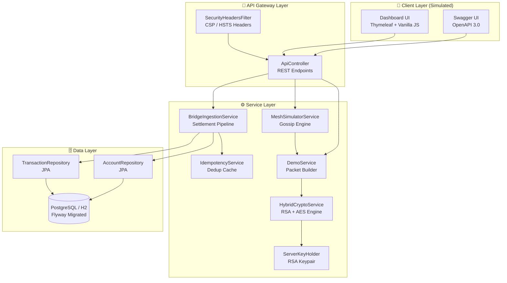
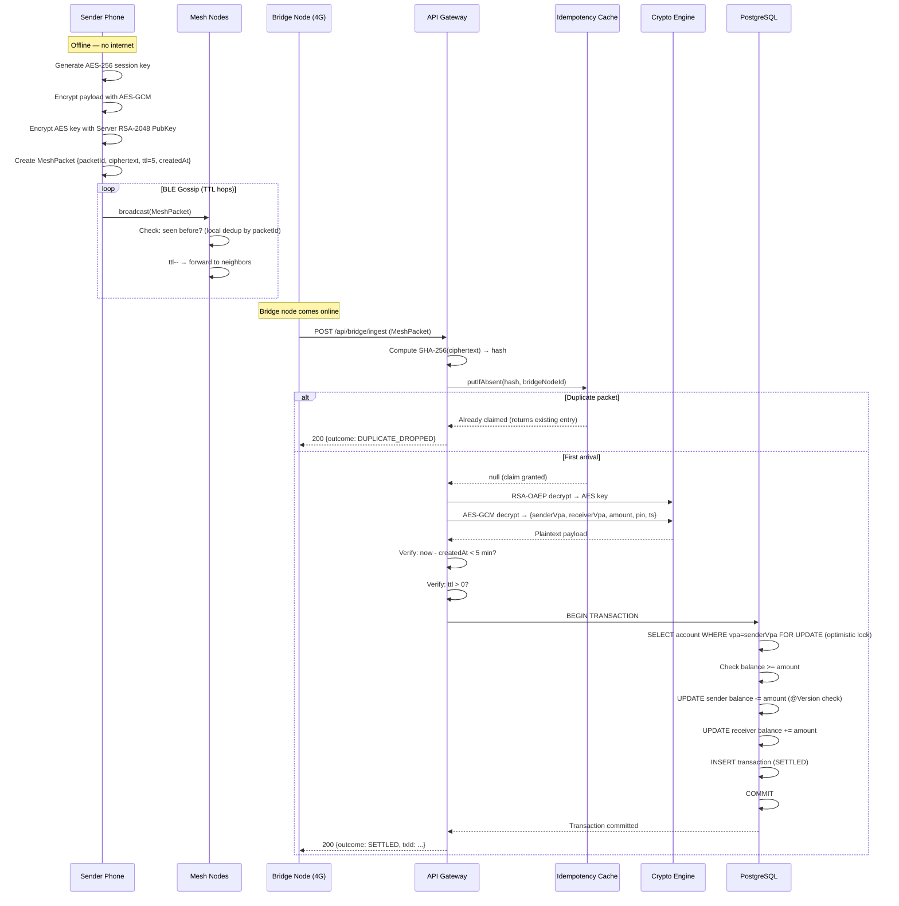
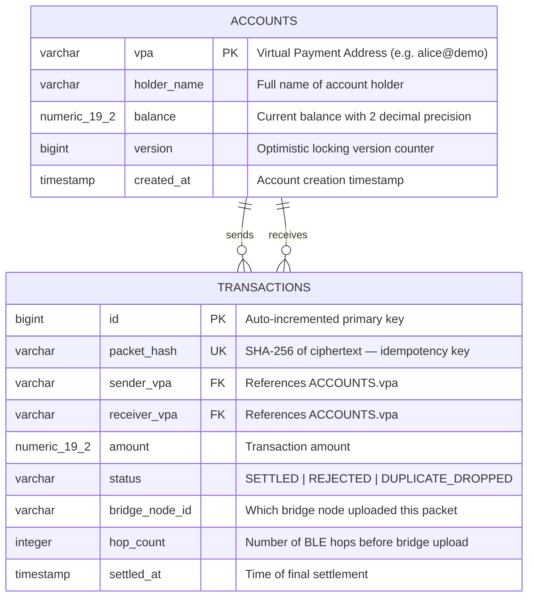

# 🌐 TrustMesh: Offline-First UPI Mesh Payment Engine

<div align="center">

[](https://github.com/nims-creation/TrustMesh/actions/workflows/ci.yml)
[](https://github.com/nims-creation/TrustMesh/releases)
[](https://spring.io/projects/spring-boot)
[](https://openjdk.org/)
[](https://www.postgresql.org/)
[](https://www.docker.com/)
[](./LICENSE)
[](https://trustmesh.onrender.com/)

**A production-grade, offline-first digital payments backend that processes UPI-style transactions over a simulated BLE Mesh network — with zero internet dependency.**

### 🌐 [▶ Try the Live Demo → trustmesh.onrender.com](https://trustmesh.onrender.com/)
> ⚠️ First load may take ~30 seconds (free tier cold start). Swagger API docs at [trustmesh.onrender.com/swagger-ui.html](https://trustmesh.onrender.com/swagger-ui.html)

[🚀 Quick Start](#-quick-start) · [🏛️ System Design](#️-system-design) · [🔐 Security Model](#-security-model) · [📡 API Reference](#-api-reference) · [🧪 Testing](#-testing) · [🐳 Deployment](#-deployment)

</div>

---

## 🧭 Table of Contents

1. [Problem Statement](#-problem-statement)
2. [Solution Overview](#-solution-overview)
3. [Quick Start](#-quick-start)
4. [System Design](#️-system-design)
   - [High-Level Architecture](#high-level-architecture)
   - [Component Architecture](#component-architecture)
   - [Data Flow — End to End](#data-flow--end-to-end)
   - [Sequence Diagram](#sequence-diagram)
   - [Database Schema Design](#database-schema-design)
   - [Concurrency & Idempotency Model](#concurrency--idempotency-model)
5. [Security Model](#-security-model)
6. [Core Features](#-core-features)
7. [Tech Stack](#️-tech-stack)
8. [API Reference](#-api-reference)
9. [Testing](#-testing)
10. [Deployment](#-deployment)
11. [Scalability Roadmap](#-scalability-roadmap)
12. [Documentation](#-documentation)

---

## 🎯 Problem Statement

> **India has 650M+ active UPI users — but over 40% of the country still lacks reliable mobile internet.**

In areas with poor or no connectivity (rural villages, underground metro stations, crowded events, disaster zones), the standard UPI transaction flow **completely fails** — even for payments as small as ₹10.

Current workarounds (UPI Lite, USSD-based payments) are limited in scope, amount-capped, and require at least intermittent connectivity or specialized network infrastructure.

**TrustMesh solves this** by enabling end-to-end encrypted payment packets to "gossip" from phone to phone over Bluetooth Low Energy (BLE) mesh networks, without any single device needing internet access — until a "bridge node" eventually surfaces online.

---

## 💡 Solution Overview

TrustMesh is a **production-grade backend simulation** of an offline-first payments mesh, implementing the following guarantees:

| Guarantee | Mechanism |
|---|---|
| **Confidentiality** | RSA-2048/OAEP + AES-256-GCM Hybrid Encryption |
| **Integrity** | AES-GCM Authentication Tag (tamper-evident) |
| **Idempotency** | SHA-256 hash-keyed concurrent lock (ConcurrentHashMap / Redis-ready) |
| **No Double-Spend** | Atomic `putIfAbsent` — only one thread settles per unique packet |
| **Replay Protection** | Timestamp freshness window (±5 min) + TTL hop counter |
| **Consistency** | Optimistic Locking (`@Version`) + Spring `@Transactional` |
| **Schema Safety** | Flyway versioned SQL migrations |

---

## 🚀 Quick Start

### Prerequisites
- Java 17+, Maven 3.8+
- Docker & Docker Compose (for production mode)

### Development Mode (H2 In-Memory)
```bash
# Clone the repository
git clone https://github.com/nims-creation/TrustMesh.git
cd TrustMesh

# Run with embedded H2 database (zero setup)
./mvnw spring-boot:run

# Access the Live Dashboard
open http://localhost:8080/

# Access Swagger API Docs
open http://localhost:8080/swagger-ui.html
```

### Production Mode (PostgreSQL via Docker)
```bash
# Build and start all services (Spring Boot + PostgreSQL)
docker-compose up --build -d

# Verify all containers are healthy
docker-compose ps

# Tail application logs
docker-compose logs -f app
```

### Demo Walkthrough (3 Steps)
```
Step 1 → Inject Payment Packet:
  Select Sender/Receiver VPA, enter ₹Amount, click "📤 Inject into Mesh"
  → An RSA+AES encrypted blob is created and placed on a simulated device

Step 2 → Gossip Round:
  Click "🔄 Run Gossip Round" (repeat 2–3x)
  → Packet hops device-to-device; hop count increments

Step 3 → Bridge Upload & Settlement:
  Click "📡 Bridges Upload to Backend"
  → Bridge nodes upload to backend; idempotency layer fires;
     ledger shows SETTLED with updated balances
```

---

## 🏛️ System Design

### High-Level Architecture

```
┌─────────────────────────────────────────────────────────────────────┐
│                         OFFLINE ZONE                                │
│                                                                     │
│   ┌──────────┐   BLE    ┌──────────┐   BLE    ┌──────────────────┐  │
│   │  Phone A │ ──────►  │  Phone B │ ──────►  │  Phone C (Bridge)│  │
│   │ (Sender) │          │ (Relay)  │          │  [Has 4G Signal] │  │
│   │          │          │          │          │                  │  │
│   │Encrypts  │          │Gossips   │          │ Uploads to Cloud │  │
│   │Packet    │          │(Blind)   │          │ when online      │  │
│   └──────────┘          └──────────┘          └────────┬─────────┘  │
│                                                         │           │
└─────────────────────────────────────────────────────────┼───────────┘
                                                          │ HTTPS/TLS
                                          ┌───────────────▼──────────────┐
                                          │      ONLINE ZONE (Backend)   │
                                          │                              │
                                          │  ┌──────────────────────┐    │
                                          │  │   Spring Boot API    │    │
                                          │  │  (Gateway + Logic)   │    │
                                          │  └──────────┬───────────┘    │
                                          │             │                │
                                          │  ┌──────────▼───────────┐    │
                                          │  │  Idempotency Cache   │    │
                                          │  │  (ConcurrentHashMap) │    │
                                          │  └──────────┬───────────┘    │
                                          │             │                │
                                          │  ┌──────────▼───────────┐    │
                                          │  │   Settlement Engine  │    │
                                          │  │ (JPA + Opt. Locking) │    │
                                          │  └──────────┬───────────┘    │
                                          │             │                │
                                          │  ┌──────────▼───────────┐    │
                                          │  │     PostgreSQL DB    │    │
                                          │  │  (accounts + txns)   │    │
                                          │  └──────────────────────┘    │
                                          └──────────────────────────────┘
```

---

### Component Architecture



---

### Data Flow — End to End

```mermaid
flowchart LR
    A([👤 Sender\nOffline Phone]) -->|"① Enter: receiver VPA,\namount, PIN"| B

    B[["🔐 Hybrid Encrypt\nAES-256-GCM key → payload\nRSA-2048 → AES key"]] -->|Ciphertext Blob| C

    C([📦 MeshPacket\npacketId, ttl, createdAt,\nciphertext]) -->|BLE Gossip| D

    D{{📱📱📱 Untrusted Relay Nodes\nCan see: packetId, ttl\nCannot see: amount, VPAs}} -->|TTL--| E

    E([📡 Bridge Node\nFirst phone with 4G]) -->|"POST /api/bridge/ingest"| F

    F{{"🔒 Idempotency Gate\nSHA-256 hash\nputIfAbsent atomic CAS"}} -->|Duplicate?| G
    F -->|First Arrival| H

    G([🚫 409 DUPLICATE_DROPPED\nNo DB write\nNo debit]) --> Z

    H[["🔓 RSA Decrypt AES Key\nAES-GCM Decrypt payload\nVerify timestamp freshness"]] --> I

    I[["✅ ACID Settlement\n@Transactional\n@Version optimistic lock\nDebit sender, Credit receiver"]] --> J

    J([📒 PostgreSQL Ledger\nSETTLED transaction\nBalances updated]) --> Z

    Z([🎉 Done])
```



---

### Sequence Diagram



---

### Database Schema Design



**Key Design Decisions:**
- `vpa` as `PRIMARY KEY` (varchar) — no surrogate key needed; VPA is globally unique
- `Numeric(19, 2)` for `balance` and `amount` — avoids floating-point precision errors in financial records
- `packet_hash` with `UNIQUE INDEX` — enforces idempotency at DB level as a safety net behind the in-memory cache
- `@Version` (bigint) on Account — enables optimistic locking without pessimistic `SELECT FOR UPDATE` locks

---

### Concurrency & Idempotency Model

The idempotency system operates in two layers — an **in-memory fast gate** and a **database safety net**:

```
Incoming Bridge Request
        │
        ▼
┌─────────────────────────────────────────────────┐
│  Layer 1: In-Memory ConcurrentHashMap           │
│  ─────────────────────────────────────────────  │
│  key   = SHA-256(ciphertext)                    │
│  value = bridgeNodeId                           │
│                                                 │
│  Operation: putIfAbsent(key, value)             │
│  ➜ Atomic CAS: No locks, O(1), JVM thread-safe │
│                                                 │
│  If returns null → FIRST ARRIVAL → proceed      │
│  If returns value → DUPLICATE → drop (fast)     │
└─────────────────────────────────────────────────┘
        │ (First Arrival only)
        ▼
┌─────────────────────────────────────────────────┐
│  Layer 2: Database UNIQUE constraint            │
│  ─────────────────────────────────────────────  │
│  idx_packet_hash UNIQUE INDEX on packet_hash    │
│                                                 │
│  Catches edge cases where two JVM instances     │
│  (horizontal scaling) both pass Layer 1.        │
│  DB throws ConstraintViolationException →       │
│  treated as DUPLICATE_DROPPED.                  │
└─────────────────────────────────────────────────┘
        │
        ▼
┌─────────────────────────────────────────────────┐
│  Layer 3: Optimistic Locking (@Version)         │
│  ─────────────────────────────────────────────  │
│  Account entity carries @Version counter.       │
│  If two threads attempt balance update on same  │
│  account, second one gets OptimisticLockExc →   │
│  Spring retries or rolls back safely.           │
└─────────────────────────────────────────────────┘
```

**Why not Pessimistic Locking?**
Pessimistic locks (`SELECT FOR UPDATE`) serialize all threads and cause lock contention at scale. Optimistic locking allows parallel reads with a cheap version-check on write — far superior throughput for payment workloads where conflicts are rare.

---

## 🔐 Security Model

### Threat Model

| Threat | Attack Vector | Mitigation |
|---|---|---|
| **Man in the Middle** | Malicious relay reads packet | AES-GCM encryption — ciphertext is opaque to relays |
| **Payload Tampering** | Relay modifies ciphertext | AES-GCM Auth Tag — any tamper causes `AEADBadTagException` on decrypt |
| **Replay Attack** | Old packet re-submitted | Timestamp check (±5 min window) + packet_hash dedup |
| **Double Spend** | Two bridges submit same packet | Atomic `putIfAbsent` + DB UNIQUE constraint |
| **Packet Flooding** | Infinite gossip loop | TTL counter — packet dropped when ttl ≤ 0 |
| **Outer Field Spoofing** | Relay changes `packetId` | Idempotency key is `SHA-256(ciphertext)` — NOT `packetId` |
| **XSS / Injection** | Dashboard frontend | Content-Security-Policy + X-Frame-Options headers |

### Hybrid Cryptography — Why RSA + AES?

```
Problem: RSA-2048 can only encrypt ~245 bytes.
         A payment payload is typically 300–500 bytes.
         Pure RSA is also slow for large data.

Solution: Hybrid Encryption (used by TLS, PGP, Signal)

  ┌─────────────────────────────────────────────────────┐
  │ Step 1: Generate random 256-bit AES session key     │
  │ Step 2: Encrypt payload with AES-256-GCM            │
  │         → Fast symmetric encryption + Auth Tag      │
  │ Step 3: Encrypt AES key with Server RSA-2048        │
  │         → Only server can recover the AES key       │
  │ Step 4: Transmit: [RSA(AES_key) || AES(payload)]    │
  └─────────────────────────────────────────────────────┘

Guarantees:
  ✅ Confidentiality — Relay phones cannot read payload
  ✅ Integrity — GCM tag detects any bit flip in transit
  ✅ Forward Secrecy (per-packet) — unique AES key each time
```

---

## ✨ Core Features

| Feature | Description |
|---|---|
| 🔐 **Hybrid Cryptography** | RSA-2048/OAEP + AES-256-GCM per-packet encryption. Intermediate nodes route ciphertext blindly — zero PII exposure. |
| ⚡ **Concurrent Idempotency** | SHA-256 hash + `ConcurrentHashMap.putIfAbsent` eliminates double-spend even under parallel bridge floods. Proven by included stress test. |
| 🔒 **Optimistic Locking** | `@Version` annotation on Account entity — no pessimistic locks, high concurrency, guaranteed balance consistency. |
| 📡 **Gossip Protocol Simulator** | Multi-hop BLE mesh with TTL decrement. Demonstrates realistic packet propagation across untrusted relay devices. |
| ⏱️ **Replay Attack Protection** | Timestamp freshness check (configurable window) + finite TTL counter prevents stale or recycled packets. |
| 📊 **Live Observability Dashboard** | Real-time topology view, account balances, transaction ledger, and activity log. Dynamic dropdowns fetched from live API. |
| 🧪 **Idempotency Stress Test** | Built-in UI button fires 3 concurrent bridge uploads via Java threads. Proves exactly 1 settles and 2 drop — no extra debit. |
| 🔌 **Encrypted Ciphertext Viewer** | Dashboard shows the actual Base64 ciphertext after injection — visually proving the relay sees only an opaque blob. |
| 🗄️ **Flyway Schema Migrations** | `V1__init.sql` versioned migrations — schema evolution is safe, repeatable, and CI-validated. |
| 🐳 **Full Docker Orchestration** | `docker-compose.yml` with health checks, profile-driven config, and dependency ordering. |
| 📝 **OpenAPI / Swagger UI** | Self-documenting REST API at `/swagger-ui.html`. |
| 🔄 **GitHub Actions CI** | Automated `mvn test` on every push. Build badge linked in README. |

---

## 🛠️ Tech Stack

| Layer | Technology | Rationale |
|---|---|---|
| **Language** | Java 17 | LTS, Records, Pattern Matching |
| **Framework** | Spring Boot 3.3.5 | Auto-configuration, JPA, WebMVC |
| **Security** | Custom `SecurityHeadersFilter` | CSP, HSTS, X-Frame-Options |
| **Cryptography** | Java JCE (RSA-OAEP, AES-GCM) | Standard library, no external crypto deps |
| **Database (Dev)** | H2 In-Memory | Zero-setup local development |
| **Database (Prod)** | PostgreSQL 16 | ACID, production-grade, NUMERIC precision |
| **Migrations** | Flyway Core | Version-controlled schema, idempotent runs |
| **ORM** | Spring Data JPA + Hibernate | Type-safe queries, optimistic locking |
| **Code Generation** | Lombok (`@Data`, `@Slf4j`) | Reduce boilerplate |
| **API Docs** | Springdoc OpenAPI 3 | Auto-generated Swagger UI |
| **Testing** | JUnit 5, Mockito, Spring Boot Test | Unit, integration, concurrency tests |
| **Containerization** | Docker, Docker Compose | Reproducible environments |
| **CI/CD** | GitHub Actions | Automated build and test |
| **Build Tool** | Maven (mvnw wrapper) | Dependency management, lifecycle |
| **Templating** | Thymeleaf + Vanilla JS | Server-side HTML, no framework overhead |
| **Fonts / UI** | Inter, JetBrains Mono (Google Fonts) | Premium, readable dashboard |

---

## 📡 API Reference

All endpoints are documented interactively at `/swagger-ui.html`.

| Method | Endpoint | Description |
|---|---|---|
| `GET` | `/api/server-key` | Returns server RSA-2048 public key for client-side encryption |
| `POST` | `/api/demo/send` | Simulate sender phone: build encrypted packet & inject into mesh |
| `POST` | `/api/demo/stress-test` | Fire same packet from 3 bridge nodes simultaneously (idempotency proof) |
| `GET` | `/api/mesh/state` | Returns current mesh topology: devices, packet counts, hop data |
| `POST` | `/api/mesh/gossip` | Run one gossip round: packets hop between mesh devices |
| `POST` | `/api/mesh/flush` | Bridge nodes attempt to upload all held packets to backend |
| `POST` | `/api/mesh/reset` | Clear mesh state and idempotency cache (demo reset) |
| `POST` | `/api/bridge/ingest` | **Core production endpoint**: ingest encrypted packet from a real bridge node |
| `GET` | `/api/accounts` | List all accounts and current balances |
| `POST` | `/api/accounts` | Create a new demo account |
| `GET` | `/api/transactions` | List latest 50 settled transactions |
| `GET` | `/api/health` | Health check endpoint |

---

## 🧪 Testing

```bash
# Run all tests
./mvnw test

# Run specific test class
./mvnw test -Dtest=IdempotencyConcurrencyTest

# Generate test report
./mvnw surefire-report:report
```

### Test Coverage

| Test Class | Type | What It Tests |
|---|---|---|
| `IdempotencyConcurrencyTest` | Integration + Concurrency | 10 threads submit same packet simultaneously → exactly 1 SETTLED |
| `LocalIdempotencyServiceTest` | Unit | `putIfAbsent` correctness, cache size limits, eviction |
| `FreshnessCheckTest` | Unit | Timestamp validation — expired packets rejected, fresh packets pass |
| `SecurityHeadersFilterTest` | Integration | CSP, HSTS, X-Frame-Options headers present on all responses |
| `HybridCryptoServiceTest` | Unit | RSA encrypt/decrypt roundtrip, AES-GCM tamper detection |

---

## 🐳 Deployment

### Docker Compose (Production)

```yaml
# docker-compose.yml provisions:
# - PostgreSQL 16 with health check
# - Spring Boot app (prod profile) depending on healthy DB
# - Flyway runs V1__init.sql automatically on startup
```

```bash
# Production deployment
docker-compose up --build -d

# Check health
curl http://localhost:8080/api/health
```

### Environment Variables

| Variable | Default | Description |
|---|---|---|
| `SPRING_PROFILES_ACTIVE` | `default` | Set to `prod` for PostgreSQL |
| `DB_HOST` | `db` | PostgreSQL host |
| `DB_PORT` | `5432` | PostgreSQL port |
| `DB_NAME` | `trustmesh` | Database name |
| `DB_USER` | `trustmesh` | Database user |
| `DB_PASSWORD` | `trustmesh` | Database password (use secrets in production) |

### ☁️ Live Deployment — Render.com (Active)

**🌐 Live URL: [https://trustmesh.onrender.com/](https://trustmesh.onrender.com/)**

Deployed on Render free tier using the included `render.yaml`. No environment variables needed — runs with H2 in-memory database for zero-config cloud demo.

```yaml
# render.yaml (included in repo)
services:
  - type: web
    name: trustmesh
    buildCommand: ./mvnw clean package -DskipTests
    startCommand: java -jar target/*.jar
    plan: free
```

### Cloud Deployment (Railway / Render with PostgreSQL)

```bash
# For production with PostgreSQL, set these env vars:
SPRING_PROFILES_ACTIVE=prod
DB_HOST=<neon-or-supabase-host>
DB_USER=<user>
DB_PASSWORD=<password>
DB_NAME=trustmesh
```

---

## 📈 Scalability Roadmap

The current architecture is designed to scale horizontally with minimal changes:

| Current (v1.0) | Next Step (v1.5) | Cloud Native (v2.0) |
|---|---|---|
| `ConcurrentHashMap` (JVM-local) | **Redis** `SET NX` (distributed idempotency) | Redis Cluster / AWS ElastiCache |
| H2 / Single PostgreSQL | **Read replicas** + connection pooling (HikariCP) | AWS RDS Aurora / PlanetScale |
| Single Spring Boot instance | **Horizontal scaling** (stateless design ready) | Kubernetes + Load Balancer |
| GitHub Actions CI | **CD pipeline** (Railway/Render auto-deploy) | ArgoCD / Helm |
| JVM in-memory metrics | **Prometheus + Grafana** | Datadog / New Relic APM |
| Manual API keys | **Spring Security + JWT** | OAuth 2.0 / API Gateway |

---

## 📚 Documentation

| Document | Description |
|---|---|
| [CHANGELOG.md](./CHANGELOG.md) | Version history and release notes |
| [CONTRIBUTING.md](./CONTRIBUTING.md) | Guidelines for contributors |
| [INTERVIEW_NOTES.md](./INTERVIEW_NOTES.md) | Technical Q&A for system design interviews |
| [SECURITY.md](./SECURITY.md) | Security policy and responsible disclosure |
| [Swagger UI (Live)](https://trustmesh.onrender.com/swagger-ui.html) | Interactive API documentation (live) |
| [Swagger UI (Local)](http://localhost:8080/swagger-ui.html) | Interactive API documentation (local) |

---

## 🤝 Contributing

Contributions are welcome! Please read [CONTRIBUTING.md](./CONTRIBUTING.md) for guidelines on branching, commit conventions, and code style.

---

## 📄 License

This project is licensed under the MIT License. See [LICENSE](./LICENSE) for details.

---

<div align="center">

**Built with ❤️ for a connected, yet offline world.**

*TrustMesh — Proving that financial inclusion doesn't need a signal.*

⭐ Star this repo if you found it useful!

</div>
