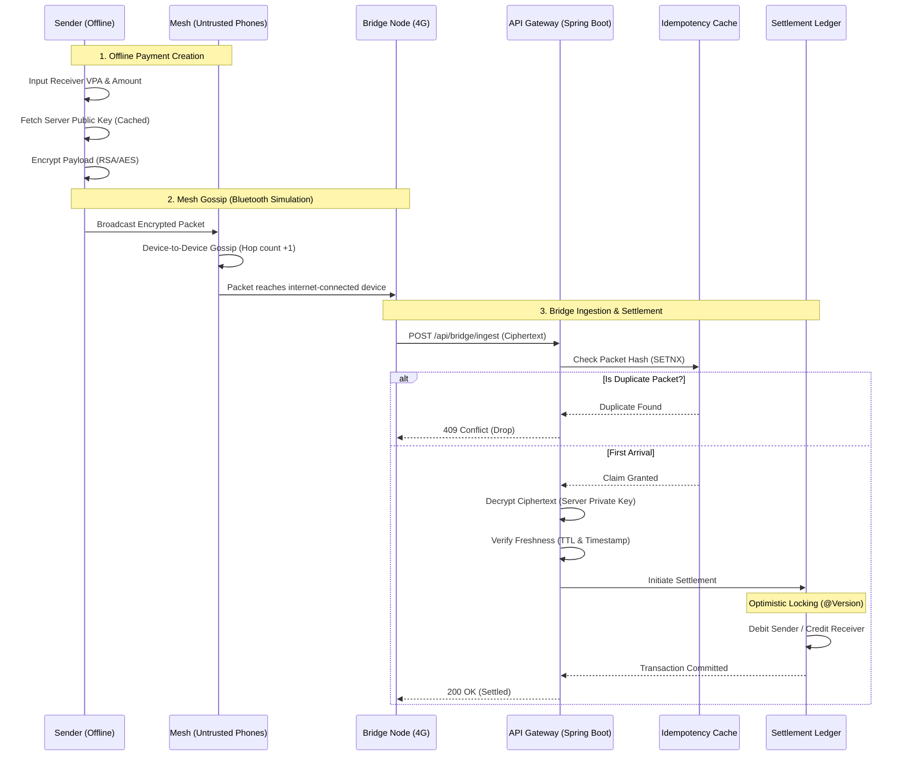

# 🌐 TrustMesh: UPI Offline Mesh System

[](https://github.com/nims-creation/TrustMesh/actions/workflows/ci.yml)
[](https://github.com/nims-creation/TrustMesh/releases)
[](https://spring.io/projects/spring-boot)
[](https://www.docker.com/)

**TrustMesh** is a highly resilient, offline-first digital payments engine designed to process transactions without internet connectivity. Inspired by UPI and built for rural penetration, it utilizes a simulated BLE (Bluetooth Low Energy) mesh network to securely encrypt, route, and gossip payment packets device-to-device until an internet-connected "bridge node" is found to process the transaction.

---

## 🚀 Quick Start

Ensure you have Docker and Docker Compose installed.

```bash
# 1. Clone the repository
git clone https://github.com/nims-creation/TrustMesh.git
cd TrustMesh

# 2. Start the application via Docker Compose
make docker-up
# Or manually: docker-compose up --build -d

# 3. Access the Live Dashboard
open http://localhost:8080/

# 4. Access the API Documentation (Swagger UI)
open http://localhost:8080/swagger-ui.html
```

---

## 🏛️ System Architecture

TrustMesh leverages an event-driven, hybrid cryptographic pipeline to ensure absolute data integrity over untrusted transit networks.



---

## ✨ Core Features

*   **Hybrid Cryptography (RSA/AES):** Secures payment details from end-to-end. Intermediate nodes route ciphertext blindly without ever seeing PII or balances.
*   **Concurrent Idempotency:** Eliminates the "Double Spend" problem inherent in mesh flooding networks. Only the very first packet to reach the server processes; subsequent duplicate arrivals are atomically dropped.
*   **Optimistic Locking (ACID):** Database-level concurrency control guarantees consistent ledgers even under extreme load.
*   **TTL & Replay Protection:** Timestamp validation and finite hop-counts prevent infinite mesh loops and stale transaction attacks.
*   **Live Observability Dashboard:** View real-time topology, account balances, and settlement ledger updates dynamically.
*   **Production Scaffolding:** Containerized with Docker, equipped with CI/CD workflows, centralized error handling, and Swagger/OpenAPI documentation.

---

## 🛠️ Tech Stack

*   **Language:** Java 23
*   **Framework:** Spring Boot 3.3.5 (WebMVC, Data JPA)
*   **Database:** H2 (In-Memory) -> Scaffolding ready for PostgreSQL
*   **Documentation:** Springdoc OpenAPI (Swagger UI)
*   **Testing:** JUnit 5, Mockito, Spring Boot Test
*   **DevOps:** Docker, Docker Compose, GitHub Actions, Makefile

## 📚 Documentation

For more internal documentation, check out:
- [CHANGELOG.md](./CHANGELOG.md)
- [CONTRIBUTING.md](./CONTRIBUTING.md)
- [SECURITY.md](./SECURITY.md)

---
*Built with ❤️ for a connected, yet offline world.*
