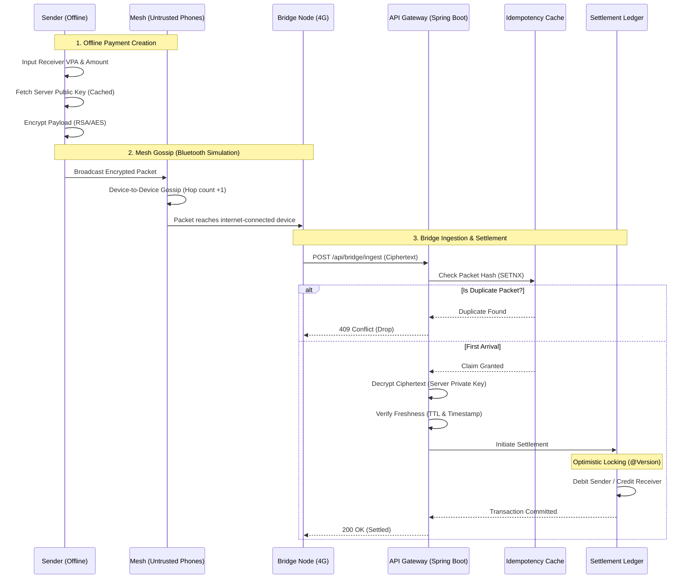

# 🌐 TrustMesh: UPI Offline Mesh System

[](https://github.com/nims-creation/TrustMesh/actions/workflows/ci.yml)
[](https://github.com/nims-creation/TrustMesh/releases)
[](https://spring.io/projects/spring-boot)
[](https://www.docker.com/)

**TrustMesh** is a highly resilient, offline-first digital payments engine designed to process transactions without internet connectivity. Inspired by UPI and built for rural penetration, it utilizes a simulated BLE (Bluetooth Low Energy) mesh network to securely encrypt, route, and gossip payment packets device-to-device until an internet-connected "bridge node" is found to process the transaction.

---

## 📑 Table of Contents
- [🚀 Quick Start](#-quick-start)
- [🏛️ System Architecture](#️-system-architecture)
- [🔍 Architecture Deep Dive](#-architecture-deep-dive)
- [✨ Core Features](#-core-features)
- [🛠️ Tech Stack](#️-tech-stack)
- [📚 Documentation](#-documentation)

---

## 🚀 Quick Start

Ensure you have Docker and Docker Compose installed.

```bash
# 1. Clone the repository
git clone https://github.com/nims-creation/TrustMesh.git
cd TrustMesh

# 2. Start the application via Docker Compose
# To run with in-memory H2 database (Development mode):
make docker-up
# Or manually: docker-compose up --build -d

# To run with PostgreSQL database (Production mode):
# Set SPRING_PROFILES_ACTIVE=prod in docker-compose.yml, then run:
# docker-compose up --build -d

# 3. Access the Live Dashboard
open http://localhost:8080/

# 4. Access the API Documentation (Swagger UI)
open http://localhost:8080/swagger-ui.html
```

---

## 🏛️ System Architecture

TrustMesh leverages an event-driven, hybrid cryptographic pipeline to ensure absolute data integrity over untrusted transit networks.



---

## 🔍 Architecture Deep Dive

### 1. Hybrid Cryptography
To secure payment packets across untrusted mesh nodes, TrustMesh uses a hybrid cryptography approach:
- Each payment generates a unique, one-time **AES-256-GCM** key.
- The payload is encrypted symmetrically using this AES key, providing both confidentiality and data integrity via the GCM authentication tag.
- The AES key is then encrypted asymmetrically using the server's **RSA-2048 Public Key** (retrieved via `/api/server-key`).
- Only the backend server, holding the private key, can decrypt the AES key and subsequently decrypt the payload. 

### 2. Mesh Routing & Gossip Protocol
The simulated mesh network relies on a flooding gossip protocol. Devices broadcast packets to all nearby nodes, decrementing a TTL (Time-To-Live) counter on each hop. This ensures maximum reachability in disconnected environments while preventing infinite loops.

### 3. Concurrent Idempotency
Because the mesh floods the network, it is highly likely that multiple bridge nodes will receive the same packet and attempt to upload it to the backend simultaneously. To prevent double-spending:
- The backend calculates a SHA-256 hash of the incoming encrypted packet.
- It uses a concurrent `putIfAbsent` operation (JVM-local or Redis) to claim an exclusive lock on that hash.
- Only the thread that successfully claims the hash proceeds to process the payment; all other threads immediately drop the packet as a duplicate.

### 4. ACID Settlement
Transactions are committed to the database (H2 or PostgreSQL) using Spring Data JPA. We employ optimistic locking (`@Version`) on the Account entity to ensure that concurrent updates do not result in lost updates or inconsistent balances.

---

## ✨ Core Features

*   **Hybrid Cryptography (RSA/AES):** Secures payment details from end-to-end. Intermediate nodes route ciphertext blindly without ever seeing PII or balances.
*   **Concurrent Idempotency:** Eliminates the "Double Spend" problem inherent in mesh flooding networks. Only the very first packet to reach the server processes; subsequent duplicate arrivals are atomically dropped.
*   **Optimistic Locking (ACID):** Database-level concurrency control guarantees consistent ledgers even under extreme load.
*   **TTL & Replay Protection:** Timestamp validation and finite hop-counts prevent infinite mesh loops and stale transaction attacks.
*   **Live Observability Dashboard:** View real-time topology, account balances, and settlement ledger updates dynamically.
*   **Production Scaffolding:** Containerized with Docker, equipped with CI/CD workflows, centralized error handling, and Swagger/OpenAPI documentation.

---

## 🛠️ Tech Stack

*   **Language:** Java 23
*   **Framework:** Spring Boot 3.3.5 (WebMVC, Data JPA)
*   **Database:** H2 (In-Memory) -> Scaffolding ready for PostgreSQL
*   **Documentation:** Springdoc OpenAPI (Swagger UI)
*   **Testing:** JUnit 5, Mockito, Spring Boot Test
*   **DevOps:** Docker, Docker Compose, GitHub Actions, Makefile

## 📚 Documentation

For more internal documentation, check out:
- [CHANGELOG.md](./CHANGELOG.md)
- [CONTRIBUTING.md](./CONTRIBUTING.md)
- [SECURITY.md](./SECURITY.md)

---
*Built with ❤️ for a connected, yet offline world.*
