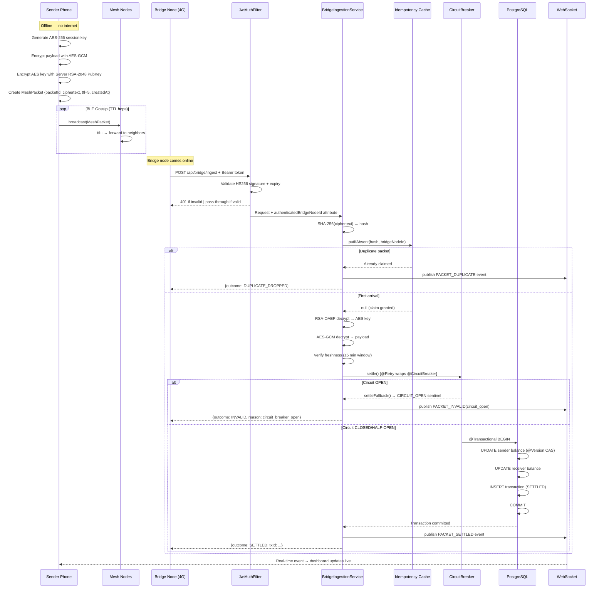
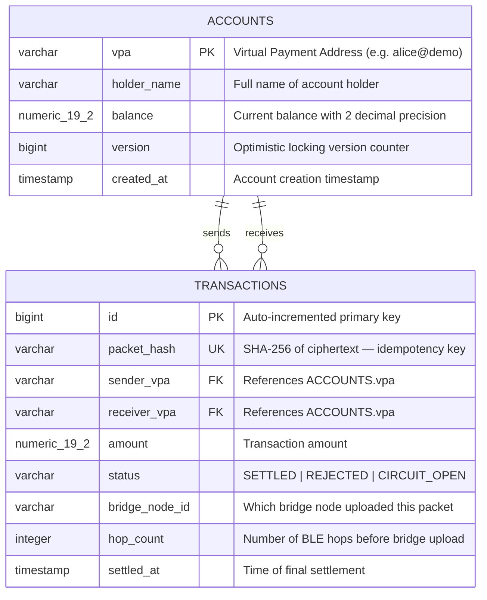

# 🌐 TrustMesh: Offline-First UPI Mesh Payment Engine

<div align="center">

[](https://github.com/nims-creation/TrustMesh/actions/workflows/ci.yml)
[](https://github.com/nims-creation/TrustMesh/releases)
[](https://spring.io/projects/spring-boot)
[](https://openjdk.org/)
[](./src/test)
[](https://www.postgresql.org/)
[](https://www.docker.com/)
[](./LICENSE)
[](https://trustmesh.onrender.com/)

**A production-grade, offline-first digital payments backend that processes UPI-style transactions over a simulated BLE Mesh network — with zero internet dependency.**

### 🌐 [▶ Try the Live Demo → trustmesh.onrender.com](https://trustmesh.onrender.com/)
> ⚠️ First load may take ~30 seconds (free tier cold start). Swagger API docs at [trustmesh.onrender.com/swagger-ui.html](https://trustmesh.onrender.com/swagger-ui.html)

[🚀 Quick Start](#-quick-start) · [🏛️ System Design](#️-system-design) · [🔐 Security Model](#-security-model) · [📡 API Reference](#-api-reference) · [🧪 Testing](#-testing) · [🐳 Deployment](#-deployment)

</div>

---

## 🧭 Table of Contents

1. [Problem Statement](#-problem-statement)
2. [Solution Overview](#-solution-overview)
3. [Quick Start](#-quick-start)
4. [System Design](#️-system-design)
   - [High-Level Architecture](#high-level-architecture)
   - [Component Architecture](#component-architecture)
   - [Data Flow — End to End](#data-flow--end-to-end)
   - [Sequence Diagram](#sequence-diagram)
   - [Database Schema Design](#database-schema-design)
   - [Concurrency & Idempotency Model](#concurrency--idempotency-model)
5. [Security Model](#-security-model)
6. [Core Features](#-core-features)
7. [Tech Stack](#️-tech-stack)
8. [API Reference](#-api-reference)
9. [Testing](#-testing)
10. [Deployment](#-deployment)
11. [Scalability Roadmap](#-scalability-roadmap)
12. [Documentation](#-documentation)

---

## 🎯 Problem Statement

> **India has 650M+ active UPI users — but over 40% of the country still lacks reliable mobile internet.**

In areas with poor or no connectivity (rural villages, underground metro stations, crowded events, disaster zones), the standard UPI transaction flow **completely fails** — even for payments as small as ₹10.

Current workarounds (UPI Lite, USSD-based payments) are limited in scope, amount-capped, and require at least intermittent connectivity or specialized network infrastructure.

**TrustMesh solves this** by enabling end-to-end encrypted payment packets to "gossip" from phone to phone over Bluetooth Low Energy (BLE) mesh networks, without any single device needing internet access — until a "bridge node" eventually surfaces online.

---

## 💡 Solution Overview

TrustMesh is a **production-grade backend simulation** of an offline-first payments mesh, implementing the following guarantees:

| Guarantee | Mechanism |
|---|---|
| **Confidentiality** | RSA-2048/OAEP + AES-256-GCM Hybrid Encryption |
| **Integrity** | AES-GCM Authentication Tag (tamper-evident) |
| **Idempotency** | SHA-256 hash-keyed concurrent lock (ConcurrentHashMap / Redis-ready) |
| **No Double-Spend** | Atomic `putIfAbsent` — only one thread settles per unique packet |
| **Replay Protection** | Timestamp freshness window (±5 min) + TTL hop counter |
| **Consistency** | Optimistic Locking (`@Version`) + Spring `@Transactional` |
| **Schema Safety** | Flyway versioned SQL migrations |
| **Observability** | Prometheus metrics + `/actuator/health` + circuit breaker state |
| **Auth** | JWT (HS256) bridge node registration — 24h expiry |
| **Resilience** | Resilience4j Circuit Breaker + Retry on settlement pipeline |
| **Real-time** | STOMP WebSocket — live event push to dashboard |

---

## 🚀 Quick Start

### Prerequisites
- Java 17+, Maven 3.8+
- Docker & Docker Compose (for production mode)

### Development Mode (H2 In-Memory)
```bash
# Clone the repository
git clone https://github.com/nims-creation/TrustMesh.git
cd TrustMesh

# Run with embedded H2 database (zero setup)
./mvnw spring-boot:run

# Access the Live Dashboard
open http://localhost:8080/

# Access Swagger API Docs
open http://localhost:8080/swagger-ui.html

# Prometheus metrics
curl http://localhost:8080/actuator/prometheus

# Register a bridge node JWT
curl -X POST http://localhost:8080/api/bridge/register \
  -H "Content-Type: application/json" \
  -d '{"deviceId":"my-bridge-01"}'
```

### Production Mode (PostgreSQL via Docker)
```bash
# Build and start all services (Spring Boot + PostgreSQL)
docker-compose up --build -d

# Verify all containers are healthy
docker-compose ps

# Tail application logs
docker-compose logs -f app
```

### Load Testing (requires k6)
```bash
# Run idempotency stress test (100 VUs, proves zero double-debits)
k6 run load-tests/stress_test.js
```

### Demo Walkthrough (3 Steps)
```
Step 1 → Inject Payment Packet:
  Select Sender/Receiver VPA, enter ₹Amount, click "📤 Inject into Mesh"
  → An RSA+AES encrypted blob is created and placed on a simulated device

Step 2 → Gossip Round:
  Click "🔄 Run Gossip Round" (repeat 2–3x)
  → Packet hops device-to-device; hop count increments

Step 3 → Bridge Upload & Settlement:
  Click "📡 Bridges Upload to Backend"
  → Bridge nodes upload to backend; idempotency layer fires;
     ledger shows SETTLED with updated balances; WebSocket pushes event live
```

---

## 🏛️ System Design

### High-Level Architecture

```
┌─────────────────────────────────────────────────────────────────────┐
│                         OFFLINE ZONE                                │
│                                                                     │
│   ┌──────────┐   BLE    ┌──────────┐   BLE    ┌──────────────────┐  │
│   │  Phone A │ ──────►  │  Phone B │ ──────►  │  Phone C (Bridge)│  │
│   │ (Sender) │          │ (Relay)  │          │  [Has 4G Signal] │  │
│   │          │          │          │          │                  │  │
│   │Encrypts  │          │Gossips   │          │ Uploads to Cloud │  │
│   │Packet    │          │(Blind)   │          │ when online      │  │
│   └──────────┘          └──────────┘          └────────┬─────────┘  │
│                                                         │           │
└─────────────────────────────────────────────────────────┼───────────┘
                                                          │ HTTPS/TLS + JWT
                                          ┌───────────────▼──────────────────┐
                                          │      ONLINE ZONE (Backend)       │
                                          │                                  │
                                          │  ┌─────────────────────────┐     │
                                          │  │   JwtAuthFilter          │     │
                                          │  │  (Bearer token check)   │     │
                                          │  └──────────┬──────────────┘     │
                                          │             │                    │
                                          │  ┌──────────▼──────────────┐     │
                                          │  │   BridgeIngestionService │     │
                                          │  │  Idempotency → Decrypt  │     │
                                          │  │  Freshness → Settle     │     │
                                          │  └──────────┬──────────────┘     │
                                          │             │                    │
                                          │  ┌──────────▼──────────────┐     │
                                          │  │  SettlementService       │     │
                                          │  │  @Retry + @CircuitBreaker│     │
                                          │  │  @Transactional + @Version│    │
                                          │  └──────────┬──────────────┘     │
                                          │             │                    │
                                          │  ┌──────────▼──────────────┐     │
                                          │  │  PostgreSQL / H2 DB     │     │
                                          │  │  (accounts + txns)      │     │
                                          │  └─────────────────────────┘     │
                                          │                                  │
                                          │  ┌─────────────────────────┐     │
                                          │  │  MeshEventPublisher      │     │
                                          │  │  → /topic/mesh-events   │     │
                                          │  │  (STOMP WebSocket)      │     │
                                          │  └─────────────────────────┘     │
                                          └──────────────────────────────────┘
```

---

### Component Architecture

```mermaid
graph TB
    subgraph CLIENT["📱 Client Layer (Simulated)"]
        UI[Dashboard UI<br/>Thymeleaf + Vanilla JS<br/>WebSocket Live Events]
        SWAGGER[Swagger UI<br/>OpenAPI 3.0]
    end

    subgraph API["🔌 API Gateway Layer"]
        JWT[JwtAuthFilter<br/>Bearer token validation]
        AC[ApiController<br/>REST Endpoints]
        SF[SecurityHeadersFilter<br/>CSP / HSTS Headers]
    end

    subgraph SERVICES["⚙️ Service Layer"]
        DS[DemoService<br/>Packet Builder]
        MSS[MeshSimulatorService<br/>Gossip Engine]
        BIS[BridgeIngestionService<br/>Settlement Pipeline]
        IS[IdempotencyService<br/>Dedup Cache]
        HCS[HybridCryptoService<br/>RSA + AES Engine]
        SS[SettlementService<br/>@Retry @CircuitBreaker]
        JWTS[JwtService<br/>HS256 Token Issuer]
        MEP[MeshEventPublisher<br/>WebSocket Events]
        MMS[MeshMetricsService<br/>Prometheus Counters]
    end

    subgraph DATA["🗄️ Data Layer"]
        AR[AccountRepository<br/>JPA]
        TR[TransactionRepository<br/>JPA]
        DB[(PostgreSQL / H2<br/>Flyway Migrated)]
    end

    UI --> AC
    SWAGGER --> AC
    SF --> AC
    JWT --> AC
    AC --> DS
    AC --> MSS
    AC --> BIS
    AC --> JWTS
    DS --> HCS
    BIS --> IS
    BIS --> SS
    BIS --> MEP
    BIS --> MMS
    SS --> AR
    SS --> TR
    MSS --> MEP
    AR --> DB
    TR --> DB
```

---

### Data Flow — End to End


```mermaid
flowchart LR
    A([👤 Sender\nOffline Phone]) -->|"① Enter: receiver VPA,\namount, PIN"| B

    B[["🔐 Hybrid Encrypt\nAES-256-GCM key → payload\nRSA-2048 → AES key"]] -->|Ciphertext Blob| C

    C([📦 MeshPacket\npacketId, ttl, createdAt,\nciphertext]) -->|BLE Gossip| D

    D{{"📱📱📱 Untrusted Relay Nodes\nCan see: packetId, ttl\nCannot see: amount, VPAs"}} -->|TTL--| E

    E([📡 Bridge Node\nFirst phone with 4G]) -->|"POST /api/bridge/ingest\nAuthorization: Bearer JWT"| F

    F{{"🔒 Idempotency Gate\nSHA-256 hash\nputIfAbsent atomic CAS"}} -->|Duplicate?| G
    F -->|First Arrival| H

    G([🚫 DUPLICATE_DROPPED\nNo DB write\nNo debit]) --> Z

    H[["🔓 RSA Decrypt AES Key\nAES-GCM Decrypt payload\nVerify timestamp freshness"]] --> I

    I[["🛡️ @Retry + @CircuitBreaker\nTransient DB failures retried\nCircuit opens on 50% failure rate"]] --> J

    J[["✅ ACID Settlement\n@Transactional\n@Version optimistic lock\nDebit sender, Credit receiver"]] --> K

    K([📒 PostgreSQL Ledger\nSETTLED transaction\nBalances updated]) --> L

    L([⚡ WebSocket Push\n/topic/mesh-events\nDashboard updates live]) --> Z

    Z([🎉 Done])
```

---

### Sequence Diagram


```mermaid
sequenceDiagram
    participant S as Sender Phone
    participant M as Mesh Nodes
    participant B as Bridge Node (4G)
    participant JWT as JwtAuthFilter
    participant GW as BridgeIngestionService
    participant IC as Idempotency Cache
    participant CB as CircuitBreaker
    participant DB as PostgreSQL
    participant WS as WebSocket

    Note over S: Offline — no internet

    S->>S: Generate AES-256 session key
    S->>S: Encrypt payload with AES-GCM
    S->>S: Encrypt AES key with Server RSA-2048 PubKey
    S->>S: Create MeshPacket {packetId, ciphertext, ttl=5, createdAt}

    loop BLE Gossip (TTL hops)
        S->>M: broadcast(MeshPacket)
        M->>M: ttl-- → forward to neighbors
    end

    Note over B: Bridge node comes online

    B->>JWT: POST /api/bridge/ingest + Bearer token
    JWT->>JWT: Validate HS256 signature + expiry
    JWT-->>B: 401 if invalid | pass-through if valid

    JWT->>GW: Request + authenticatedBridgeNodeId attribute
    GW->>GW: SHA-256(ciphertext) → hash
    GW->>IC: putIfAbsent(hash, bridgeNodeId)

    alt Duplicate packet
        IC-->>GW: Already claimed
        GW->>WS: publish PACKET_DUPLICATE event
        GW-->>B: {outcome: DUPLICATE_DROPPED}
    else First arrival
        IC-->>GW: null (claim granted)
        GW->>GW: RSA-OAEP decrypt → AES key
        GW->>GW: AES-GCM decrypt → payload
        GW->>GW: Verify freshness (±5 min window)

        GW->>CB: settle() [@Retry wraps @CircuitBreaker]

        alt Circuit OPEN
            CB-->>GW: settleFallback() → CIRCUIT_OPEN sentinel
            GW->>WS: publish PACKET_INVALID(circuit_open)
            GW-->>B: {outcome: INVALID, reason: circuit_breaker_open}
        else Circuit CLOSED/HALF-OPEN
            CB->>DB: @Transactional BEGIN
            DB->>DB: UPDATE sender balance (@Version CAS)
            DB->>DB: UPDATE receiver balance
            DB->>DB: INSERT transaction (SETTLED)
            DB->>DB: COMMIT
            DB-->>GW: Transaction committed
            GW->>WS: publish PACKET_SETTLED event
            GW-->>B: {outcome: SETTLED, txId: ...}
        end
    end

    WS-->>S: Real-time event → dashboard updates live
```

---

### Database Schema Design


```mermaid
erDiagram
    ACCOUNTS {
        varchar vpa PK "Virtual Payment Address (e.g. alice@demo)"
        varchar holder_name "Full name of account holder"
        numeric_19_2 balance "Current balance with 2 decimal precision"
        bigint version "Optimistic locking version counter"
        timestamp created_at "Account creation timestamp"
    }

    TRANSACTIONS {
        bigint id PK "Auto-incremented primary key"
        varchar packet_hash UK "SHA-256 of ciphertext — idempotency key"
        varchar sender_vpa FK "References ACCOUNTS.vpa"
        varchar receiver_vpa FK "References ACCOUNTS.vpa"
        numeric_19_2 amount "Transaction amount"
        varchar status "SETTLED | REJECTED | CIRCUIT_OPEN"
        varchar bridge_node_id "Which bridge node uploaded this packet"
        integer hop_count "Number of BLE hops before bridge upload"
        timestamp settled_at "Time of final settlement"
    }

    ACCOUNTS ||--o{ TRANSACTIONS : "sends"
    ACCOUNTS ||--o{ TRANSACTIONS : "receives"
```

**Key Design Decisions:**
- `vpa` as `PRIMARY KEY` (varchar) — no surrogate key needed; VPA is globally unique
- `Numeric(19, 2)` for `balance` and `amount` — avoids floating-point precision errors
- `packet_hash` with `UNIQUE INDEX` — DB-level idempotency as safety net behind in-memory cache
- `@Version` (bigint) on Account — optimistic locking without pessimistic `SELECT FOR UPDATE`
- `CIRCUIT_OPEN` status — sentinel for graceful circuit breaker fallback

---

### Concurrency & Idempotency Model

```
Incoming Bridge Request (JWT validated)
        │
        ▼
┌─────────────────────────────────────────────────┐
│  Layer 1: In-Memory ConcurrentHashMap           │
│  key   = SHA-256(ciphertext)                    │
│  value = bridgeNodeId                           │
│  Operation: putIfAbsent(key, value)             │
│  ➜ Atomic CAS: No locks, O(1), JVM thread-safe │
│  If returns null → FIRST ARRIVAL → proceed      │
│  If returns value → DUPLICATE → drop (fast)     │
└─────────────────────────────────────────────────┘
        │ (First Arrival only)
        ▼
┌─────────────────────────────────────────────────┐
│  Layer 2: Resilience4j Circuit Breaker          │
│  Opens after 50% failure rate (10-call window)  │
│  Fallback: CIRCUIT_OPEN sentinel (no throw)     │
│  Prevents DB failure storm cascade              │
└─────────────────────────────────────────────────┘
        │
        ▼
┌─────────────────────────────────────────────────┐
│  Layer 3: Resilience4j Retry                    │
│  Max 3 attempts, 200ms delay                    │
│  Retries JpaSystemException + OptimisticLock    │
│  Does NOT retry InsufficientFundsException      │
└─────────────────────────────────────────────────┘
        │
        ▼
┌─────────────────────────────────────────────────┐
│  Layer 4: Database UNIQUE constraint            │
│  idx_packet_hash on packet_hash                 │
│  Catches race between two JVM instances         │
└─────────────────────────────────────────────────┘
        │
        ▼
┌─────────────────────────────────────────────────┐
│  Layer 5: Optimistic Locking (@Version)         │
│  Account entity carries @Version counter.       │
│  Second concurrent update → OptimisticLockExc   │
│  Spring rolls back safely — no corrupt balance  │
└─────────────────────────────────────────────────┘
```

---

## 🔐 Security Model

### Threat Model

| Threat | Attack Vector | Mitigation |
|---|---|---|
| **Man in the Middle** | Malicious relay reads packet | AES-GCM encryption — opaque to relays |
| **Payload Tampering** | Relay modifies ciphertext | AES-GCM Auth Tag — any tamper → `AEADBadTagException` |
| **Replay Attack** | Old packet re-submitted | Timestamp check (±5 min) + packet_hash dedup |
| **Double Spend** | Two bridges submit same packet | Atomic `putIfAbsent` + DB UNIQUE constraint |
| **Packet Flooding** | Infinite gossip loop | TTL counter — packet dropped when ttl ≤ 0 |
| **Outer Field Spoofing** | Relay changes `packetId` | Idempotency key is `SHA-256(ciphertext)` not `packetId` |
| **Unauthorized Bridge** | Rogue device calls /bridge/ingest | JWT auth — 401 without valid registered token |
| **DB Failure Storm** | DB errors cascade to ingestion | Resilience4j circuit breaker — opens at 50% failure rate |
| **XSS / Injection** | Dashboard frontend | Content-Security-Policy + X-Frame-Options headers |

---

## ✨ Core Features

| Feature | Description |
|---|---|
| 🔐 **Hybrid Cryptography** | RSA-2048/OAEP + AES-256-GCM per-packet encryption. Relay nodes route ciphertext blindly — zero PII exposure. |
| ⚡ **Concurrent Idempotency** | SHA-256 hash + `ConcurrentHashMap.putIfAbsent` eliminates double-spend under parallel bridge floods. Proven by k6 stress test (100 VUs, 0 violations). |
| 🔒 **Optimistic Locking** | `@Version` annotation — no pessimistic locks, high concurrency, guaranteed balance consistency. |
| 📡 **Gossip Protocol Simulator** | Multi-hop BLE mesh with TTL decrement. Demonstrates realistic packet propagation across untrusted relay devices. |
| ⏱️ **Replay Attack Protection** | Timestamp freshness check + finite TTL counter prevents stale or recycled packets. |
| 📊 **Live Observability Dashboard** | Real-time topology view, account balances, transaction ledger, and WebSocket activity log. |
| 🔑 **JWT Bridge Auth** | `POST /api/bridge/register` issues HS256 JWT (24h). `/api/bridge/ingest` requires `Authorization: Bearer` header. |
| 🛡️ **Circuit Breaker + Retry** | Resilience4j `@CircuitBreaker` opens at 50% failure. `@Retry` handles transient DB errors (3 attempts, 200ms). |
| ⚡ **WebSocket Real-Time Events** | STOMP over SockJS — 7 event types pushed to `/topic/mesh-events`. Dashboard goes from polling to live push. |
| 📈 **Prometheus Metrics** | 7 custom Micrometer counters + P50/P95/P99 settlement latency histogram. Grafana-ready. |
| 📝 **5 Architecture Decision Records** | ADR-001 to ADR-005 explain every major design choice with rejected alternatives. |
| 🧪 **k6 Load Tests** | Idempotency stress (100 VUs, 1 packet → exactly 1 SETTLED) + throughput ramp (P99 < 500ms). |
| 🗄️ **Flyway Schema Migrations** | `V1__init.sql` versioned migrations — schema evolution is safe, repeatable, and CI-validated. |
| 🐳 **Full Docker Orchestration** | `docker-compose.yml` with health checks, profile-driven config, and dependency ordering. |
| 📝 **OpenAPI / Swagger UI** | Self-documenting REST API at `/swagger-ui.html`. |

---

## 🛠️ Tech Stack

| Layer | Technology | Rationale |
|---|---|---|
| **Language** | Java 17 | LTS, Records, Pattern Matching |
| **Framework** | Spring Boot 3.3.5 | Auto-configuration, JPA, WebMVC |
| **Security** | JwtAuthFilter + SecurityHeadersFilter | JWT bridge auth + CSP/HSTS/X-Frame-Options |
| **Cryptography** | Java JCE (RSA-OAEP, AES-GCM) | Standard library — no external crypto deps |
| **Database (Dev)** | H2 In-Memory | Zero-setup local development |
| **Database (Prod)** | PostgreSQL 16 | ACID, production-grade, NUMERIC precision |
| **Migrations** | Flyway Core | Version-controlled schema |
| **ORM** | Spring Data JPA + Hibernate | Type-safe queries, optimistic locking |
| **Resilience** | Resilience4j 2.2.0 | Circuit breaker + retry (AOP proxies) |
| **Auth** | JJWT 0.12.6 | HS256 JWT issuance and validation |
| **Observability** | Spring Actuator + Micrometer + Prometheus | Metrics, health, Prometheus scrape |
| **WebSocket** | spring-boot-starter-websocket (STOMP) | Real-time mesh events |
| **Load Testing** | k6 | Idempotency stress + throughput benchmarks |
| **Code Generation** | Lombok | Reduce boilerplate |
| **API Docs** | Springdoc OpenAPI 3 | Auto-generated Swagger UI |
| **Testing** | JUnit 5, Mockito, Spring Boot Test | 31 tests: unit, integration, concurrency |
| **Containerization** | Docker, Docker Compose | Reproducible environments |
| **CI/CD** | GitHub Actions | Automated build and test on every push |
| **Build Tool** | Maven (mvnw wrapper) | Dependency management, lifecycle |
| **Templating** | Thymeleaf + Vanilla JS | Server-side HTML, no framework overhead |

---

## 📡 API Reference

All endpoints documented interactively at `/swagger-ui.html`.

| Method | Endpoint | Auth | Description |
|---|---|---|---|
| `GET` | `/api/server-key` | None | RSA-2048 public key for client encryption |
| `POST` | `/api/bridge/register` | None | Register bridge node → returns JWT |
| `POST` | `/api/demo/send` | None | Simulate sender: build encrypted packet & inject |
| `POST` | `/api/demo/stress-test` | None | Fire same packet from 3 bridges simultaneously |
| `GET` | `/api/mesh/state` | None | Mesh topology: devices, packet counts |
| `POST` | `/api/mesh/gossip` | None | Run one gossip round |
| `POST` | `/api/mesh/flush` | None | Bridge nodes upload all held packets |
| `POST` | `/api/mesh/reset` | None | Clear mesh + idempotency cache |
| `POST` | `/api/bridge/ingest` | **JWT** | Production endpoint: ingest from real bridge node |
| `GET` | `/api/accounts` | None | All accounts + balances |
| `GET` | `/api/accounts/{vpa}` | None | Single account by VPA (404 if not found) |
| `POST` | `/api/accounts` | None | Create demo account |
| `GET` | `/api/transactions` | None | Latest 50 settled transactions |
| `GET` | `/api/stats` | None | Account count, tx count, cache size, mesh summary |
| `GET` | `/api/health` | None | Health + JVM metrics + business metrics snapshot |
| `GET` | `/actuator/prometheus` | None | Prometheus scrape endpoint |
| `GET` | `/actuator/circuitbreakers` | None | Circuit breaker state |

---

## 🧪 Testing

```bash
# Run all 31 tests
./mvnw test

# Run specific test class
./mvnw test -Dtest=JwtAuthTest
./mvnw test -Dtest=IdempotencyConcurrencyTest

# Generate test report
./mvnw surefire-report:report

# Run k6 load test
k6 run load-tests/stress_test.js
```

### Test Coverage — 31 Tests

| Test Class | Type | What It Tests |
|---|---|---|
| `JwtAuthTest` (4) | Unit + Integration | Token round-trip, invalid inputs, register endpoint, 401 on missing auth |
| `IdempotencyConcurrencyTest` (3) | Concurrency | 10 threads same packet → exactly 1 SETTLED |
| `LocalIdempotencyServiceTest` (2) | Unit | `putIfAbsent` correctness, cache size |
| `FreshnessCheckTest` (3) | Unit | Expired packets rejected, fresh packets pass |
| `SettlementServiceTest` (2) | Unit | Correct debit/credit, InsufficientFunds thrown |
| `InsufficientFundsTest` (2) | Integration | 422 response, balance unchanged |
| `MeshAndCryptoTest` (3) | Integration | Reset clears state, hash deterministic, unknown VPA |
| `GlobalExceptionHandlerTest` (2) | Integration | 400 validation + 422 business error with JWT |
| `SecurityHeadersFilterTest` (2) | Integration | CSP, HSTS, X-Frame-Options on all responses |
| `ApiControllerIntegrationTest` (3) | Integration | Full pipeline: inject → gossip → flush → settle |
| `AccountEntityTest` (5) | Unit | Account entity, balance arithmetic, VPA validation |

---

## 🐳 Deployment

### Docker Compose (Production)
```bash
# Production deployment
docker-compose up --build -d

# Check health
curl http://localhost:8080/api/health

# Check circuit breaker state
curl http://localhost:8080/actuator/circuitbreakers

# Prometheus metrics
curl http://localhost:8080/actuator/prometheus
```

### Environment Variables

| Variable | Default | Description |
|---|---|---|
| `SPRING_PROFILES_ACTIVE` | `default` | Set to `prod` for PostgreSQL |
| `DB_HOST` | `db` | PostgreSQL host |
| `DB_PORT` | `5432` | PostgreSQL port |
| `DB_NAME` | `trustmesh` | Database name |
| `DB_USER` | `trustmesh` | Database user |
| `DB_PASSWORD` | `trustmesh` | Change in production! |
| `JWT_SECRET` | see properties | HS256 signing key — rotate in production |

### ☁️ Live Deployment — Render.com

**🌐 Live URL: [https://trustmesh.onrender.com/](https://trustmesh.onrender.com/)**

Deployed on Render free tier using the included `render.yaml`. Runs with H2 in-memory for zero-config demo.

---

## 📈 Scalability Roadmap

| Current (v2.0) | Next Step | Cloud Native |
|---|---|---|
| `ConcurrentHashMap` (JVM-local) | **Redis** `SET NX EX` (distributed idempotency) | Redis Cluster / ElastiCache |
| H2 / Single PostgreSQL | Read replicas + HikariCP | AWS RDS Aurora |
| HS256 JWT | **RS256** with AWS KMS (external verifiers) | OAuth 2.0 / APIG |
| In-process Circuit Breaker | Distributed circuit state (Redis) | Istio service mesh |
| Single Spring Boot instance | Horizontal scaling (stateless ready) | Kubernetes + HPA |
| Prometheus local | **Grafana Cloud** dashboard | Datadog / New Relic APM |
| ConcurrentHashMap idempotency | Redis `SETNX` — [ADR-005](docs/adr/ADR-005-redis-production-idempotency.md) | Distributed atomic |

---

## 📚 Documentation

| Document | Description |
|---|---|
| [CHANGELOG.md](./CHANGELOG.md) | Full version history — v1.0 and v2.0 feature breakdown |
| [CONTRIBUTING.md](./CONTRIBUTING.md) | Guidelines for contributors |
| [INTERVIEW_NOTES.md](./INTERVIEW_NOTES.md) | Technical Q&A — 25+ interview questions with answers |
| [SECURITY.md](./SECURITY.md) | Security policy, threat model, responsible disclosure |
| [docs/adr/](./docs/adr/) | 5 Architecture Decision Records |
| [load-tests/](./load-tests/) | k6 stress test scripts + benchmark results |
| [Swagger UI (Live)](https://trustmesh.onrender.com/swagger-ui.html) | Interactive API docs |

---

## 🤝 Contributing

Contributions are welcome! Please read [CONTRIBUTING.md](./CONTRIBUTING.md) for guidelines.

---

## 📄 License

MIT License. See [LICENSE](./LICENSE) for details.

---

<div align="center">

**Built with ❤️ for a connected, yet offline world.**

*TrustMesh — Proving that financial inclusion doesn't need a signal.*

⭐ Star this repo if you found it useful!

</div>
